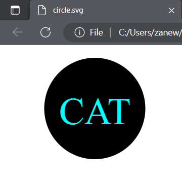
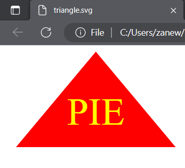
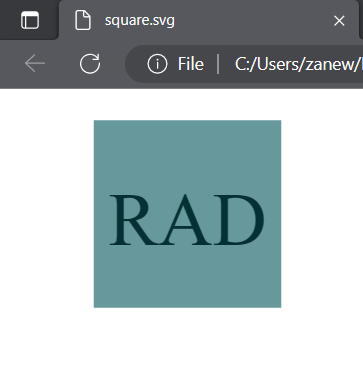

# SVG Logo Maker!

## About The Application

Have you found yourself in a position where you want a really simple logo for something, but don't want to hire a graphic designer or take the time to create one? Well this application will help you with that!

When going through the prompts of this application, it will generate you an SVG file fit to your input! It will ask you;

* What you want your logo to say (limited to only 3 characters)

* What color you want for your logo text

* Which shape you want used in your logo (choose between a circle, triangle or square)

* And finally it will ask what color you want your shape to be!

## Issues

I didn't really run into many issues this time around thanfully! I was able to utilize my resources of past projects and activities to really guide me on creating this application. I did have a couple minor ones though;

* The first issue was, I had no idea how to utilize a gitignore, so initially my node_modules folder was pushed up to my repository! But after talking to my instructors, I was able to fix it very easily!

* One other very small issue was, that I had no idea how SVG files worked coming into this, but thanks to the example SVG in the README, I was able to learn pretty quick on how to make one. (Messing around with the points for the triangle was interesting too)

## Screenshots

I will provide a video of the working application below, followed by a couple screenshots!

https://github.com/Bidoofs-Dad/SVG-Logo-Maker/assets/126542828/2e207c53-7d72-4ae0-b6c6-00682ebcd998

<video width="1000" controls>
  <source src="images\demonstrating app.mp4" type="video/mp4">
</video>
 
 
 

## Conclusion

In conclusion, I quite enjoyed this project! It wasn't extremely tough at all and felt like a really great balance of challenging but also rewarding! Having more knowledge of node now definitely helped as well, it really makes you wonder what other types of generators you can create with it!

I may even come back and update this with more shapes and maybe more style options!

## The Link

Below is the link that will take you to the repository of this application!

https://github.com/Bidoofs-Dad/SVG-Logo-Maker
